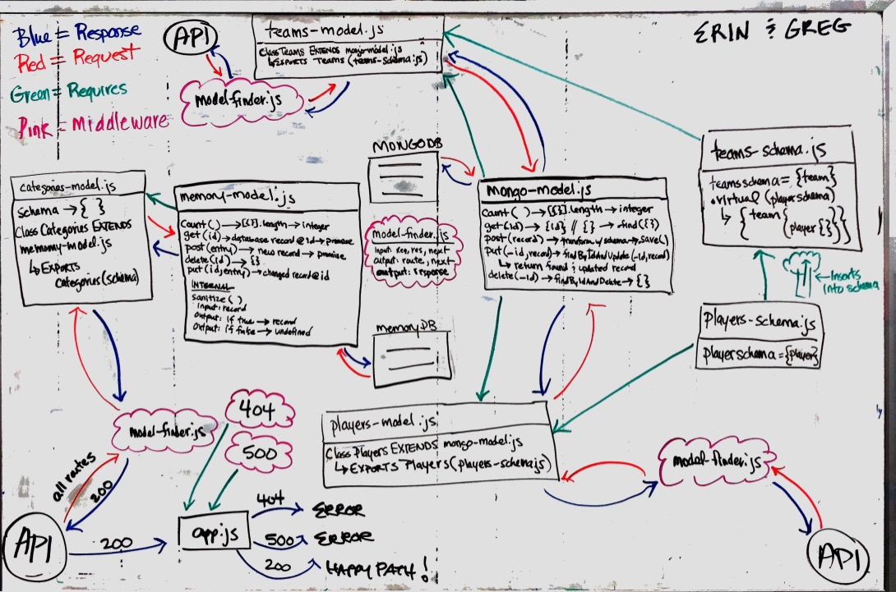

 LAB
=================================================

## API Server

### Author: Erin Trainor and Aaron Ferris
[

### Links and Resources
* [PR](https://github.com/codefellows-js-401d29-aaron-ferris/lab16/pull/1)  
* [travis](https://www.travis-ci.com/codefellows-js-401d29-aaron-ferris/lab16)  

#### Documentation
* [jsdoc](https://github.com/codefellows-js-401d29-aaron-ferris/lab16/tree/working/docs)

### Setup
#### `.env` requirements
* `PORT` - 3000
* `MONGODB_URI` - MONGODB_URI=MONGODB_URI=mongodb://localhost:27017/users
* `SECRET` - TMNT
* Add a role
  * echo '{"role":"superuser", "capabilities":["create","read","update","delete", "superuser"]}' | http :3000/roles
  * echo '{"role":"admin", "capabilities":["create","read","update","delete"]}' | http :3000/roles
  * echo '{"role":"editor", "capabilities":["create", "read", "update"]}' | http :3000/roles
  * echo '{"role":"user", "capabilities":["read"]}' | http :3000/roles

#### Running the app
* To run Mongo
  * Open 3 terminal tabs
    * First tab
      * mongod --dbpath=/Users/erintrainor/codefellows/data/db (substitute your file path)
      * Second tab
        * mongo
      * Third tab
        * nodemon
  
#### Terminal commands to manipulate databaes
* Add a User
  * echo '{"username":"michelangelo", "password":"michelangelo", "role":"superuser"}' | http post :3000/signup
  * echo '{"username":"leonardo", "password":"leonardo", "role":"admin"}' | http post :3000/signup
  * echo '{"username":"donatello", "password":"donatello", "role":"editor"}' | http post :3000/signup
  * echo '{"username":"raphael", "password":"raphael", "role":"user"}' | http post :3000/signup
* Sign-In
  * http post :3000/signin -a michelangelo:michelangelo
  * http post :3000/signin -a leonardo:leonardo
  * http post :3000/signin -a donatello:donatello
  * http post :3000/signin -a raphael:raphael
* Add a team (after signing-in) - The signed in user must have create permission (all users except raphael)
  * echo '{"name":"TMNT"}' | http POST :3000/api/teams "Authorization: Bearer ${access_token}"
  * echo '{"name":"Foot Clan"}' | http POST :3000/api/teams "Authorization: Bearer ${access_token}"
* Add a player (after signing-in) - The signed in user must have create permission
  * echo '{"name":"Shredder", "position":"P", "throws":"R", "bats":"R", "team":"Foot Clan"}' | http POST :3000/api/players "Authorization: Bearer ${access_token}"
  * echo '{"name":"April", "position":"SS", "throws":"L", "bats":"L", "team":"TMNT"}' | http POST :3000/api/players "Authorization: Bearer ${access_token}"
* Routes accessible for all users
  * http get :3000/api/teams
  * http get :3000/api/teams/1
  * http get :3000/api/players
  * http get :3000/api/players/1
* Routes accessible for users with 'update' capability (all users except raphael)
  * echo '{"name":"Purple Clan"}' | http put :3000/api/teams/1 "Authorization: Bearer ${access_token}"
  * echo '{"name":"Purple Dragons"}' | http patch :3000/api/teams/1 "Authorization: Bearer ${access_token}"
  * echo '{"name":"Michaelangelo", "position":"SS", "throws":"L", "bats":"L", "team":"TMNT"}' | http put :3000/api/players/1 "Authorization: Bearer ${access_token}"
  * echo '{"position":"P"}' | http patch :3000/api/players/1 "Authorization: Bearer ${access_token}"
* Routes accessible for users with 'delete'capability (only leonardo and michelangelo) 
  * http delete :3000/api/teams/1 "Authorization: Bearer ${access_token}"
  * http delete :3000/api/players/1 "Authorization: Bearer ${access_token}"
#### Tests
* How do you run tests?
  * npm run test
* What assertions were made?
  * Only what is part of the sample code
* What assertions need to be / should be made?
  * additional things

#### UML

